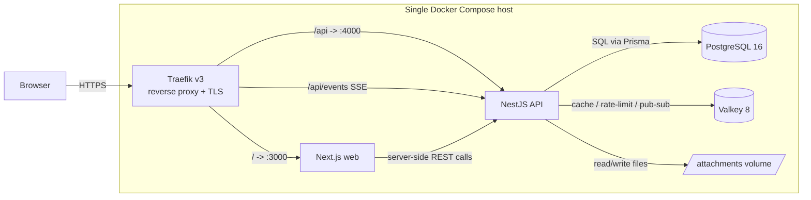
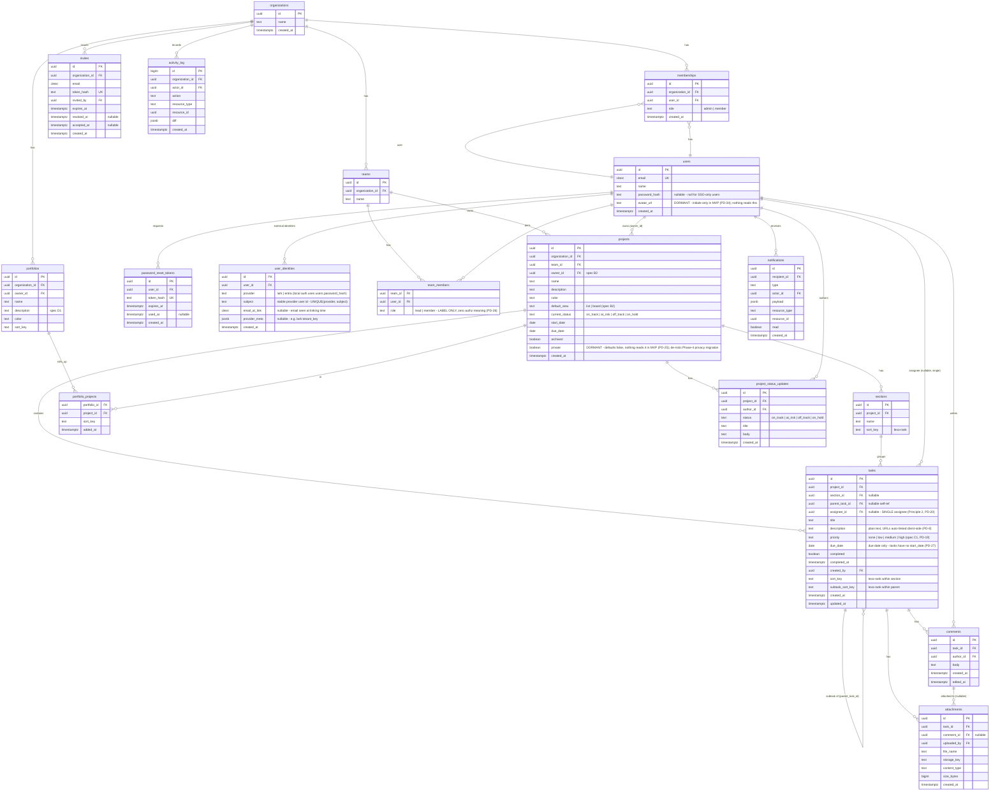

# Architecture — Self-Hosted Program & Project Management Tool

**Author:** Tech Lead · **Date:** 20 July 2026 · **Status:** v2.1 — owner-requested revision (20 Jul): permissive-license stack policy (Traefik replaces Caddy, Valkey replaces Redis, licensing appendix added) + multi-provider auth with toggleable local/Lark sign-in (D-018…D-021). Base: Draft v2 — pending spec v1.1 sign-off (sign-off order: spec → architecture/design → build, per PD-38)
**Scope:** MVP (6 weeks, 3×2-week sprints) for 10–50 users, self-hosted Docker Compose.
**Product model:** Asana-style — projects/tasks/sections/boards **plus** a portfolio layer (roll-ups, portfolio timeline), which is exactly the gap that ruled out most benchmarked competitors (see `pm-tool-benchmark/research-notes.md`, Asana "Portfolio specifics").

Guiding principle: **boring, proven choices**; every decision below is tagged **[one-way door]** or **[reversible]**.

---

## 1. Architecture overview

### 1.1 Monorepo: pnpm workspaces (no Turborepo) — [reversible]

Plain **pnpm workspaces**. Turborepo's remote caching and task graph pay off with many packages and many contributors; we have 2 builders (Product Engineer + Tech Lead), ~4 packages, and CI runs that will finish in minutes anyway. Adding Turborepo later is a one-file change (`turbo.json`) — deferring it costs nothing.

```
/
├── package.json / pnpm-workspace.yaml
├── apps/
│   ├── web/            # Next.js (App Router, React)
│   └── api/            # NestJS
├── packages/
│   ├── shared/         # DTO types, zod schemas, enums, ordering utils (lexo-rank)
│   └── config/         # shared eslint/tsconfig/prettier presets
├── prisma/             # schema.prisma + migrations (owned by apps/api, hoisted for tooling)
├── docker/             # Dockerfiles, traefik.yml (static config) + dynamic config
├── docker-compose.yml / docker-compose.prod.yml
└── .github/workflows/
```

`packages/shared` is the contract between web and api: request/response types and zod schemas are defined once and imported by both — this is our cheap insurance against front/back drift on an aggressive timeline.

### 1.2 Components and communication

- **Next.js web** — UI only. Talks to the API over REST (JSON) via a typed fetch client generated from shared types. No direct DB access from Next server components (one data path only; keeps auth/authz in one place).
- **NestJS api** — all business logic, validation, authz, persistence. Serves REST + one SSE endpoint for realtime.
- **PostgreSQL 16** — system of record.
- **Valkey 8** — three jobs: session/refresh-token denylist cache, rate-limit counters, pub/sub fan-out for SSE (so realtime survives running >1 api replica later). Valkey is the Linux Foundation fork of Redis 7.2 (BSD-3-Clause) and is Redis-protocol drop-in compatible — `ioredis` and BullMQ work unchanged. Chosen over Redis because Redis ≥ 7.4 is licensed RSALv2/SSPLv1 (8.x adds AGPLv3) — none of which fit the permissive-only policy (Appendix: Licensing).
- **Traefik v3** — reverse proxy + TLS termination (built-in ACME/Let's Encrypt), security-header middlewares, single public entrypoint. MIT-licensed (see Appendix: Licensing).
- **Attachments volume** — local disk behind a storage interface (§5).



No message broker, no microservices, no k8s. One API process handles 50 users with ease; background work (notification fan-out, activity log writes) runs in-process via a lightweight queue (BullMQ on the existing Valkey) — [reversible: extract a worker container by changing compose, not code].

---

## 2. Application architecture (NestJS)

### 2.1 Module decomposition

One Nest module per product module; module boundaries mirror the ERD aggregate boundaries.

| Module | Owns | Notes |
|---|---|---|
| `auth` | login/logout/refresh, password-reset tokens, guards, multi-provider identity framework (`IdentityProvider` port, per-provider enable/disable, `user_identities`, break-glass CLI) | §4.3 — local + Lark toggleable; Entra OIDC drops in later |
| `orgs` | organizations, memberships, org-level roles, invites (tokenized, expiring, revocable — spec A3) | Single-org install is the MVP reality, but model orgs anyway (cheap now, painful later) |
| `teams` | teams, team membership | Grouping + default access scope for projects |
| `projects` | projects, sections, project membership, status colors/icons | Section CRUD lives here (sections are project-scoped) |
| `tasks` | tasks, subtasks, assignees, ordering, due dates | The hot path; owns lexo-rank reordering logic |
| `portfolios` | portfolios, portfolio_projects, project_status_updates, timeline query | Roll-up read models live here, not in `projects` |
| `collab` | comments, attachments | Attachments use `StorageProvider` (§5) |
| `notifications` | in-app notification inbox, SSE event stream | Consumes domain events; email deferred post-MVP; 90-day retention (spec F1) enforced by a nightly BullMQ purge job |
| `search` | cross-entity search endpoint | MVP = `ILIKE`/`pg_trgm` prefix+substring on titles/names only (spec E2); module isolates the Phase-1 tsvector/full-text upgrade |
| `activity` | activity_log write + per-task/project feed read | Append-only; written via domain events |
| `core` (infrastructure) | Prisma service, Valkey service, config, logging, health | No business rules ever |

### 2.2 Where business rules live

- **Domain services** (`tasks/task.service.ts` etc.) hold all business rules: "completing a parent task does not auto-complete subtasks", "a project must belong to exactly one team", "a status update is project-level and any org member may post one" (spec §2.1 two-role model — corrected per PD-26). Controllers are thin: parse → authorize → delegate → shape response.
- **Cross-module communication** is via Nest's `EventEmitter2` domain events (`task.completed`, `comment.created`, `project.status_updated`). `notifications` and `activity` are pure consumers — no module imports another module's service except through its public exports. This keeps the 6-week codebase decoupled without inventing a bus.
- **Transactions**: any multi-table write (task move + reorder, status update + activity) is one Prisma transaction inside the owning service.

### 2.3 Validation strategy

- **Edge validation**: zod schemas in `packages/shared`, enforced by a Nest `ZodValidationPipe` (global). The same schemas validate forms client-side — one definition, two enforcement points.
- **Invariant validation**: DB constraints (FKs, `CHECK`, unique indexes) are the last line — e.g. unique `(project_id, portfolio_id)` in `portfolio_projects`. Never trust the app layer alone.
- **Authz**: `PoliciesGuard` per route checks role from membership tables (§6 RBAC matrix). Row-level scoping is done in queries (every query filters by `organization_id`), not by RLS — Postgres RLS is overkill for a single-org MVP [reversible].

### 2.4 Error model

RFC 9457 problem-details JSON, one global exception filter:

```json
{ "type": "https://errors.pm.internal/task-not-found",
  "title": "Task not found", "status": 404,
  "detail": "Task 7f3a… does not exist or you lack access",
  "instance": "/api/v1/tasks/7f3a…", "code": "TASK_NOT_FOUND" }
```

Rules: 400 validation (with zod issue list in `errors[]`), 401 unauthenticated, 403 unauthorized, 404 for both missing *and* inaccessible (no existence leak), 409 conflict (stale reorder, duplicate), 422 semantic rejection, 429 rate limit. Stack traces never leave the server; every response carries an `x-request-id` echoed in logs.

---

## 3. Data model

### 3.1 ERD (MVP entities)



Notes:
- **Single assignee is schema-enforced** (PD-20): `tasks.assignee_id` is a nullable FK — one task, one assignee, per Principle 2 and spec C1. The earlier `task_assignees` M:N join is deleted; if Phase-N ever needs collaborators/followers, that is a *new* `task_followers` table with distinct semantics, not a widening of assignment.
- **Subtasks** are a self-reference (`parent_task_id`). MVP allows **one level** of nesting (enforced in service, `CHECK` deferred) — matches Asana's practical usage, avoids recursive-query complexity in views.
- **Invites and password-reset tokens** (spec A2/A3): tokens stored hashed (never plaintext), single-use, expiring (invites 14 d per spec A3, resets 1 h), revocable. Accepting an invite creates the `users` row + `memberships` row in one transaction.
- **`user_identities` ships in the MVP schema** (empty until Lark goes live in week 7, D-020): one row per external identity, `UNIQUE (provider, subject)`. Enabling a provider is a deploy + env change, never a migration. Local auth stays on `users.password_hash` (nullable — a Lark-only user has no password).
- **Dormant columns, explicitly inert**: `users.avatar_url` (initials-only in MVP, PD-34) and `projects.private` (defaults false; no authz branch, no RBAC row, no UI reads it — kept only to avoid a Phase-4 backfill migration, per the PD-25 ruling). CI greps assert no non-migration code references them.
- **Multi-homing tasks across projects** (Asana feature) is explicitly **out of MVP**: task belongs to exactly one project. [one-way door softened: if ever needed, introduce a `task_projects` join and backfill — schema change but mechanical.]
- `projects.current_status` is denormalized from the latest `project_status_updates` row (updated in the same transaction) so portfolio roll-up reads never join/aggregate status history.
- `notifications.payload` jsonb keeps the inbox render self-contained (no N+1 hydration).

### 3.2 Ordering scheme: fractional / lexo-rank strings — [reversible]

Boards and lists need stable drag-and-drop ordering without rewriting rows.

- `sort_key` is a base-62 **fractional index** string (à la Figma / lexo-rank). Insert-between = generate key between neighbors; only the moved row is written.
- Implementation: small utility in `packages/shared` (~100 lines, well-known algorithm; we use the `fractional-indexing` npm package rather than hand-rolling).
- Scopes: sections order within a project; tasks within a section (`sort_key`); subtasks within a parent (`subtask_sort_key`); projects within a portfolio.
- **Conflict handling**: two clients inserting at the same spot can generate equal keys — allowed (ties broken by `created_at, id` in the ORDER BY), and a background compaction re-spreads keys if a scope's average key length exceeds a threshold. No user-visible failure mode.
- Rejected alternatives: integer positions (O(n) rewrites, race-prone), linked lists (miserable to query).

### 3.3 Indexing

| Index | Purpose |
|---|---|
| `tasks (project_id, section_id, sort_key)` | board/list rendering — the hot query |
| `tasks (parent_task_id, subtask_sort_key)` | subtask lists |
| `tasks (project_id, completed, due_date)` | filters, "due soon" |
| `tasks (assignee_id, completed, due_date)` | "My Tasks" view (incl. Overdue-first grouping and the PD-9 owner-nudge query) |
| `comments (task_id, created_at)` | task detail pane |
| `notifications (recipient_id, read, created_at DESC)` | inbox badge + list |
| `notifications (created_at)` | nightly 90-day retention purge (spec F1) |
| `activity_log (resource_type, resource_id, created_at DESC)` | per-entity feed |
| `portfolio_projects` PK `(portfolio_id, project_id)` + `(project_id)` | roll-ups both directions |
| `project_status_updates (project_id, created_at DESC)` | latest status + staleness (≤7 d, PD-10) |
| `tasks USING GIN (title gin_trgm_ops)`; same on `projects.name`, `portfolios.name` | MVP search — `pg_trgm` substring/prefix match (spec E2); tsvector deferred to Phase 1 (PD-28) |
| `invites` unique `(token_hash)`; `password_reset_tokens` unique `(token_hash)` | single-use token lookup |
| `memberships` unique `(organization_id, user_id)`; `users` unique `citext email` | integrity |

All FKs get supporting indexes (Postgres does not auto-create them). Partial index `tasks (project_id) WHERE completed = false` if list views prove slow — measure first.

---

## 4. API design

### 4.1 REST conventions

- Base path `/api/v1`. Plural nouns, shallow nesting only where the child is meaningless without the parent: `/projects/:id/tasks`, `/tasks/:id/comments`, `/portfolios/:id/projects`. Everything else top-level (`/tasks/:id`).
- `GET` list/read, `POST` create, `PATCH` partial update (we never `PUT`), `DELETE` delete. Reorder is an explicit action: `POST /tasks/:id/move { sectionId, beforeTaskId?, afterTaskId? }` — server computes the sort_key so clients can't corrupt ordering.
- Responses are enveloped: `{ "data": …, "meta": { … } }`. Timestamps ISO-8601 UTC. IDs are UUIDv7 (time-sortable, index-friendly).
- **URL/ID ruling (PD-29, one scheme across all three docs):** UUIDv7 is the only identifier — in the API and in web URLs. Web routes: `/tasks/:id`, `/projects/:id`, `/portfolios/:id`, with `?task=:id` as the side-peek overlay param. **No vanity slugs** (`PRJ-8fk2` etc.) in MVP — a slug table is Phase-1 polish, not week-1 routing. Deep links (notifications, search results, Teams pastes) all resolve through these canonical paths.

### 4.2 Pagination

**Cursor-based** everywhere (`?cursor=…&limit=50`, default 50, max 200), cursor = opaque base64 of `(sort_key || created_at, id)`. Offset pagination is banned — it breaks under concurrent inserts, which is exactly the board use case. `meta.nextCursor` null-terminates.

### 4.3 Auth: a multi-provider framework — local + Lark, each independently toggleable; Entra ready (D-020)

**Session model (provider-independent).** Whoever authenticates you, *we* mint the same first-party session: short-lived access JWT (15 min, httpOnly Secure SameSite=Lax cookie) + rotating refresh token (7 days, httpOnly cookie, denylist in Valkey on logout/rotation). No localStorage tokens (XSS). Guards, RBAC, SSE auth, and the frontend never learn which provider was used; provider tokens are consumed at login time only and never passed downstream.

**Provider framework (built in MVP Sprint 1; only the Lark implementation is deferred to week 7):**

1. **`IdentityProvider` port.** One interface — `authenticate(input) → IdentityClaims { provider, subject, email, emailVerified, name }`. Implementations: `LocalPasswordProvider` (argon2id, MVP), `LarkOAuthProvider` (week 7, first post-MVP item), `EntraOidcProvider` (Phase 3 in delivery-plan numbering, via `openid-client`). Zero changes to session issuance, guards, or any downstream module per provider.
2. **Per-provider enable/disable via environment config** — the owner's requirement:
   - `AUTH_LOCAL_ENABLED` (default `true`) — email/password, invites, admin reset links.
   - `AUTH_LARK_ENABLED` (default `false`) — requires `LARK_APP_ID` + `LARK_APP_SECRET`; `LARK_BASE_URL` defaults to `https://open.larksuite.com` (set the Feishu domain `https://open.feishu.cn` for CN tenants — same provider code, different base URL).
   - **Boot validation fails fast** if zero providers are enabled, or an enabled provider is missing credentials — clear startup error, documented in the runbook.
   - `GET /api/v1/auth/providers` returns the enabled set; the login page renders only what is enabled (password form, "Continue with Lark" button, or both). Toggling is config + restart, not a settings screen (an admin UI for this is Phase-4 polish at most).
3. **Identity is separate from user.** External identities live in `user_identities (provider, subject — unique)`, in the MVP schema from day 1 (§3.1); `users.password_hash` is nullable. Resolution order in `IdentityService`: (a) `(provider, subject)` match → sign in; (b) else verified-email match to an existing **active** user → link the identity (recorded in `activity_log`) and sign in; (c) else apply the provisioning policy: `AUTH_LARK_PROVISIONING=invite_only` (default) rejects with "ask an admin for an invite" — `auto` JIT-creates a member, optionally fenced by `AUTH_ALLOWED_EMAIL_DOMAINS` and/or `LARK_ALLOWED_TENANT_KEY`.
4. **Lockout safety (consequence of toggles).** Disabling local auth while Lark is misconfigured or down must never brick the install: a break-glass CLI on the VM (`node dist/cli auth-recover`) re-enables local auth and/or mints an admin password-reset link, bypassing HTTP entirely. Startup logs a warning if local auth is disabled and any active admin has no linked external identity. Documented in the runbook next to the restore drill.

**`LarkOAuthProvider` specifics.** OAuth 2.0 authorization-code flow against the configured base domain: redirect to Lark's authorize endpoint with a session-bound `state` (CSRF); the callback exchanges the code server-side at Lark's OAuth token endpoint (client secret never leaves the API); profile fetched from the authen user-info endpoint. Stable subject = `union_id` (fallback `open_id`); `tenant_key` stored in `provider_meta` and optionally enforced. Note: the user's email is only present if the Lark app is granted the email scope in the Lark admin console — without it, email-based auto-linking is impossible and `invite_only` + explicit linking applies. Endpoints and scopes are configuration, so Lark (larksuite.com) and Feishu (feishu.cn) tenants use the same code path.

**The drop-in guarantee** stays, now stated for all providers: adding or toggling a provider touches only `apps/api/src/auth/**` and the login page — kept honest by an acceptance test.

### 4.4 Realtime: SSE for MVP — [reversible]

Decision: **Server-Sent Events**, one endpoint `GET /api/v1/events` (auth via session cookie), backed by Valkey pub/sub. Client subscribes to the entities it has open (project board, task, notifications badge); events are thin (`{ type: "task.updated", taskId, projectId }`) and the client refetches — no state-sync protocol to design or debug.

Why not the alternatives, against a 6-week clock:
- **Polling**: simplest, but 50 users × per-board polling gives worse UX (multi-second staleness) for barely less work than SSE — Nest supports SSE natively (`@Sse()`), so SSE is ~2 days.
- **WebSocket**: bidirectional transport we don't need (all writes go through REST), plus gateway lifecycle, reconnect/backoff, and proxy config to get right. Deferred; if we ever need client→server streaming (live cursors, presence), the Valkey pub/sub backbone already exists and the client swap is contained in one hook.

Fallback: SSE auto-reconnects natively; on top we refetch-on-window-focus (React Query default), so a dropped stream degrades to slightly-stale, never wrong.

**Build-order rule (PD-4, formalizing risk #4's mitigation as schedule):** SSE is the *last* Sprint-3 item, started only after board, portfolio roll-up, and notifications are demo-complete. Pre-agreed cut line: if week 5 opens with any red feature, SSE is dropped from MVP without a meeting and optimistic-update + refetch-on-focus ships as the realtime story (AC0.2 is satisfiable that way). The Valkey pub/sub plumbing costs nothing to keep for a Phase-1 revival.

### 4.5 API docs

Nest's OpenAPI generation is on from day 1 (`/api/docs`, dev only). Cheap, and the Product Engineer and Designer both consume it.

---

## 5. File storage: local volume behind a `StorageProvider` port — [reversible by design]

**MVP: local Docker volume** (`/data/attachments`, laid out `orgId/attachmentId/filename`). MinIO would be a 6th container to operate, back up, and secure for zero MVP benefit at 10–50 users.

Swappability is enforced, not hoped for:
- `collab` depends only on `StorageProvider { put(stream, meta) → storageKey; getStream(storageKey); delete(storageKey); }`. `LocalDiskStorage` is the MVP impl; `S3Storage` (MinIO/any S3) is a config-selected impl later. `attachments.storage_key` is provider-agnostic.
- Downloads always stream **through the API** (authz check per request) — never direct file URLs. This also means switching to S3 presigned URLs later is an optimization inside the provider, not an API change.
- Limits: 25 MB/file, allowlist-by-extension + sniffed content-type, per-org quota counter (soft 10 GB, warning in admin). Files served with `Content-Disposition: attachment` + `X-Content-Type-Options: nosniff` (no stored-XSS via uploaded HTML/SVG).

---

## 6. Non-functionals (10–50 users)

### 6.1 Performance targets

| Metric | Target |
|---|---|
| API p95 (reads: board, list, portfolio) | < 300 ms |
| API p95 (writes: task CRUD, reorder) | < 200 ms |
| Portfolio timeline (25 projects) | < 500 ms |
| Web LCP on board view (intranet) | < 2.0 s |
| SSE event → UI refresh | < 2 s |
| Concurrent users | 50 (design), tested to 100 via k6 smoke |

These are comfortable on one 4 vCPU / 8 GB VM; we assert them in a Sprint-3 k6 run, not continuously.

### 6.2 Backup / restore

- **Nightly `pg_dump -Fc`** (custom format) at 02:00 via a `backup` sidecar container; kept 14 daily + 8 weekly, written to a second disk/mount (and, recommended, synced off-VM — owner's call, e.g. rclone to any SMB/Azure blob).
- **Attachments volume**: nightly `restic` (or tar) snapshot to the same backup target, same retention.
- **Weekly VM-level snapshot** if the hypervisor supports it (belt and braces).
- **Restore is rehearsed, not assumed**: the runbook (§7.4) includes a restore drill executed once before go-live and quarterly after (`pg_restore` into a scratch container + checksum a known row count).
- RPO 24 h / RTO 2 h — acceptable for an internal tool; document it so nobody assumes better.

### 6.3 Logging & observability — deliberately lean

- **Structured JSON logs** (pino) from api and web, one line per request: `x-request-id`, user id, route, status, duration. `docker compose logs` + `jq` is the MVP log UI; ship to Loki later only if pain demands.
- **Healthchecks**: `/healthz` (liveness) and `/readyz` (checks Postgres + Valkey) on the API; Docker `HEALTHCHECK` on every service; Traefik serves a static maintenance page (errors middleware) if api is down.
- **Error tracking**: self-hostable GlitchTip *or* just log-based for MVP — decision left to Sprint 3 slack; not on the critical path.
- Explicitly **not** doing: metrics stack (Prometheus/Grafana), tracing, k8s. Revisit at >100 users.

### 6.4 Security

- **OWASP basics**: argon2id password hashing; zod validation on every input; Prisma parameterization (no raw SQL except the roll-up aggregate and the trigram search query, both with bound params); httpOnly SameSite cookies + CSRF double-submit token on state-changing routes; security headers via Traefik middlewares (HSTS, X-Frame-Options DENY, nosniff) with CSP (`default-src 'self'`) set by the apps; OAuth callbacks protected by session-bound `state` (§4.3); dependency audit in CI (`pnpm audit` + Dependabot).
- **Rate limiting**: `@nestjs/throttler` on Valkey — global 100 req/min/user, `POST /auth/login` 5/min/IP with exponential lockout (OAuth callback endpoints included), uploads 20/hour/user.
- **Secrets**: `.env.prod` file on the VM, `chmod 600`, never in git (git-secrets hook in CI); rotated by redeploy. Docker/Swarm secrets are overkill for one VM [reversible].
- **RBAC matrix (MVP)** — exactly **two org roles** (spec §2.1); "lead" is a persona, not a permission (PD-26); guest role is post-MVP. All projects are org-visible — no privacy in MVP (PD-25; the dormant `projects.private` column has no row here and no authz branch):

| Capability | Org **Admin** | Org **Member** |
|---|---|---|
| Manage org, users, teams, invites | ✔ | ✖ |
| Create project / portfolio | ✔ | ✔ |
| View any project, portfolio & tasks | ✔ | ✔ |
| Create/edit tasks, comment, attach | ✔ | ✔ |
| Edit/archive project, post status update | ✔ | ✔ (any member — not gated to owner/lead) |
| Manage portfolio contents | ✔ | ✔ |
| Delete org data / restore backups | ✔ | ✖ |

`team_members.role` (`lead|member`) is a **display label only** — it appears in the UI, is read by zero guards and zero policies, and is documented as such in `PoliciesGuard`. The RBAC table-driven integration test (§8) asserts the whole matrix, including that a plain member can edit projects and post status updates.

---

## 7. Deployment: Docker Compose

### 7.1 Services

| Service | Image | Notes |
|---|---|---|
| `traefik` | traefik:v3 | 80/443 published; auto-TLS via built-in ACME (Let's Encrypt) or internal CA for intranet-only; `acme.json` on a volume; dashboard disabled in prod; the **only** service with published ports |
| `web` | our Next.js image (multi-stage, standalone output) | |
| `api` | our NestJS image (multi-stage, distroless-ish node:22-slim) | runs `prisma migrate deploy` as entrypoint step |
| `postgres` | postgres:16 | volume `pgdata`; not exposed to host |
| `valkey` | valkey/valkey:8 | AOF on; not exposed; Redis-protocol compatible (BSD-3) |
| `backup` | postgres:16 + cron script | nightly pg_dump + attachment snapshot (§6.2) |

**Traefik over Caddy and nginx** — [reversible; revised per D-018]: the original draft chose Caddy for zero-config auto-TLS. The owner set a **permissive-license-only policy** for every shipped runtime component, to keep future commercialization unencumbered. For accuracy: Caddy v2 itself is Apache-2.0 (commercial use is permitted — the historical restriction applied to v1's official binaries), but Traefik is MIT, equally capable here (built-in ACME auto-TLS, header middlewares, native Docker provider), and swapping now removes any diligence-time discussion entirely. nginx (BSD-2) + certbot remains the maximally-boring fallback, at the cost of a second moving part (cert renewal + reload orchestration) — adopt it only if Traefik misbehaves. Config lives in `docker/traefik.yml` + one dynamic file; routing via container labels.

### 7.2 ORM: Prisma — [semi one-way door: switching ORMs mid-flight is expensive; chosen deliberately]

Prisma over TypeORM because: (1) schema-first with generated, actually-sound TypeScript types — with 2 builders moving fast, compile-time query safety is our main defense; (2) `prisma migrate` produces reviewable SQL migrations with a clean deploy story (`migrate deploy` is idempotent and CI-testable), versus TypeORM's historically brittle sync/migration behavior; (3) the team knows it. Known costs accepted: no lazy relations (fine — we want explicit queries), raw SQL escape hatch needed for the portfolio roll-up aggregate and the `pg_trgm` search query (fine — 2 queries, tested).

### 7.3 Environments

- **dev**: `docker-compose.yml` runs postgres/valkey only; web+api run on the host with hot reload (`pnpm dev`). Seed script creates demo org/projects/portfolio.
- **prod**: `docker-compose.prod.yml` (all six services), `.env.prod` for secrets, images built in CI and pulled by tag (git SHA) — the VM never builds.

### 7.4 Zero-to-running runbook (outline — full doc in `docs/runbook.md`)

1. Provision VM (Ubuntu 24.04, 4 vCPU/8 GB/100 GB + backup disk); install Docker + compose plugin.
2. DNS A record → VM; open 80/443 (intranet firewall rules as required).
3. `git clone` repo (or copy release bundle); `cp .env.prod.example .env.prod`; fill secrets (`openssl rand` helpers documented).
4. `docker compose -f docker-compose.prod.yml up -d` — api entrypoint runs migrations; Traefik obtains certs via ACME.
5. `docker compose exec api node dist/cli seed-admin` → first admin user.
6. Verify `/readyz`, log in, create org. 7. Run restore drill once (§6.2). Target: **under 1 hour**.

### 7.5 Upgrade strategy

- Release = git tag → CI builds/pushes images tagged with SHA + version.
- Upgrade = `git pull && docker compose pull && docker compose up -d`. Api entrypoint runs `prisma migrate deploy` before serving; **migrations must be backward-compatible one version** (expand → migrate → contract discipline) so a rollback is just redeploying the previous tag. Destructive migrations require a pre-upgrade backup checkpoint (scripted).
- Brief downtime (<1 min) during `up -d` is acceptable for an internal tool; no blue/green.

---

## 8. Testing strategy (ruthless 6-week cut)

| Layer | Tooling | Mandatory in 6 weeks | Deferred |
|---|---|---|---|
| **Unit** | Vitest | Ordering utils (fractional index — exhaustive, incl. tie/rebalance), authz policies, roll-up calculators, IdentityService | Broad coverage targets — no % gate |
| **Integration (API)** | Vitest + Testcontainers (real Postgres+Valkey) | The contract per module: auth flows (login, invite accept, password reset, provider-toggle boot validation), task CRUD + **move/reorder races**, portfolio roll-up + timeline query, RBAC matrix as a table-driven test (incl. any-member-can-post-status), pagination cursors | Notification fan-out edge cases |
| **E2E** | Playwright | **One smoke path**: login → create project → add sections/tasks → drag reorder → assign → comment+attach → create portfolio → see roll-up + timeline → status update appears | Cross-browser, visual regression, mobile |
| **Load** | k6 | One Sprint-3 script: 100 VUs on board read + reorder + portfolio timeline, assert §6.1 | Sustained soak |

Principles: integration tests against a **real** Postgres (Testcontainers) are the backbone — mocked-DB tests would miss exactly our risk areas (ordering, constraints, roll-up SQL). E2E stays at one smoke flow; it's a tripwire, not a spec.

**CI (GitHub Actions)**, per PR (~6–8 min): lint + typecheck → unit → integration (services: postgres, valkey) → build images → Playwright smoke against compose stack → `pnpm audit` → **license gate** (license-checker against the Appendix allowlist — a copyleft/source-available dependency fails the build). `main` builds and pushes release images. A scheduled weekly job runs `prisma migrate deploy` against a restored copy of the latest prod dump — migration + backup verification in one.

---

## 9. Technical risk register (top 5)

| # | Risk | Likelihood / Impact | Mitigation |
|---|---|---|---|
| 1 | **Board ordering conflicts** — concurrent drags produce duplicate/exhausted fractional keys, items "jump" | Med / Med | Server-computed keys only (`/move` API); ties tolerated with deterministic tie-break; background rebalance; dedicated race-condition integration tests; SSE refresh makes the other client converge in <2 s |
| 2 | **Portfolio timeline/roll-up query cost** — N projects × M tasks aggregates get slow or, worse, get built as N+1 in the app | Med / High (it's the differentiating feature) | Single SQL aggregate per portfolio (raw, indexed, tested with seeded 50-project/10k-task dataset in Sprint 2 — not Sprint 3); denormalized `projects.current_status`; k6 assertion < 500 ms; fallback: 60 s Valkey cache on the roll-up read (one flag) |
| 3 | **Attachment storage growth / backup bloat** — volume outgrows disk or makes backups slow | Med / Med | 25 MB/file cap + per-org quota + admin usage view from day 1; attachments on separate mount; `StorageProvider` seam means MinIO/S3 migration is a copy script + config flip, no API change |
| 4 | **Realtime scope creep** — SSE turns into a half-built state-sync layer eating Sprint 2/3 | High / High (timeline risk) | Events are notify-only (client refetches); hard scope: task/board/notification events only; polling-on-focus already works without SSE, so SSE can be cut in extremis without losing correctness |
| 5 | **Single-VM data loss / failed restore** — backups exist but don't restore | Low / Critical | `pg_dump` + volume snapshot + off-VM sync (§6.2); restore drill pre-go-live and quarterly; weekly CI job restores latest dump and runs migrations against it — a corrupt backup is detected within 7 days, not at disaster time |

Watchlist (not top-5): Prisma raw-SQL drift on the two hand-written queries (covered by integration tests); Next.js/Nest version churn (pin minors, upgrade in Sprint gaps); auth-seam erosion (acceptance test in §4.3 keeps SSO honest).

---

## Appendix: decision summary

| Decision | Choice | Door |
|---|---|---|
| Monorepo tooling | pnpm workspaces (no Turborepo) | reversible |
| ORM | Prisma | semi one-way |
| Ordering | fractional indexing (lexo-rank strings) | reversible |
| Auth | JWT cookie sessions + multi-provider `IdentityProvider` framework; local + Lark independently toggleable via env; Entra later (D-020) | designed for provider drop-in |
| Realtime | SSE + Valkey pub/sub, notify-then-refetch | reversible (WS later) |
| Attachments | local volume behind `StorageProvider` | reversible (S3-compatible later — see licensing appendix re: MinIO) |
| Proxy/TLS | Traefik v3 (MIT) — D-018 | reversible (nginx + certbot fallback) |
| Cache/queue/pub-sub | Valkey 8 (BSD-3), Redis-protocol drop-in — D-019 | reversible |
| License policy | permissive-only runtime stack, CI-gated allowlist — D-021 | policy (see licensing appendix) |
| Multi-homing tasks | excluded from MVP | additive migration if needed |
| Pagination | cursor-based only | one-way (good) |
| IDs / URLs | UUIDv7 everywhere; web `/tasks/:id` + `?task=` overlay; no slugs | one-way (good) |
| Task assignment | single nullable `assignee_id` FK (no M:N) | one-way by design (Principle 2) |
| MVP search | `ILIKE`/`pg_trgm` on titles/names | reversible (tsvector in Phase 1) |
| SSE scheduling | last Sprint-3 item, pre-agreed cut to refetch-on-focus | schedule rule (PD-4) |

---

## Appendix: Licensing & commercialization audit (D-018, D-019, D-021)

**Policy (owner-set, 20 Jul 2026):** every component that ships as part of the Cairn runtime must carry a permissive license — MIT, BSD, Apache-2.0, ISC, PostgreSQL, OFL, CC0 class. No copyleft (GPL/AGPL), no source-available (SSPL, RSAL, BUSL, FSL, Elastic) in shipped components. Dev-only tooling that is never distributed with the product is exempt but tracked below. Enforced by a **CI license gate** (license-checker allowlist) so a stray transitive dependency fails the build instead of surfacing during due diligence.

### Shipped runtime components — all permissive

| Component | License | Note |
|---|---|---|
| Node.js | MIT-style | |
| Next.js / React | MIT | |
| NestJS | MIT | |
| Prisma | Apache-2.0 | |
| PostgreSQL 16 | PostgreSQL License (permissive) | |
| **Valkey 8** | **BSD-3-Clause** | Replaces Redis (D-019); Redis-protocol drop-in — `ioredis`/BullMQ unchanged |
| BullMQ / ioredis | MIT | |
| **Traefik v3** | **MIT** | Replaces Caddy (D-018) |
| zod | MIT | |
| anime.js v4 | MIT | |
| fractional-indexing | CC0 | |
| Inter / JetBrains Mono | SIL OFL 1.1 | Embedding/bundling in a commercial product is permitted; the fonts themselves may not be sold standalone |
| Docker Engine (on the VM) | Apache-2.0 | Server-side engine is unencumbered |

### Deliberately avoided or swapped

| Component | License problem | Our position |
|---|---|---|
| **Redis ≥ 7.4** | RSALv2 / SSPLv1 (8.x offers AGPLv3) — source-available/copyleft | Swapped to Valkey (D-019) |
| **Caddy** | None in fact — v2 is Apache-2.0 (v1 binary licensing history caused the confusion) | Swapped to MIT Traefik anyway under the blanket policy (D-018) |
| **MinIO** | AGPLv3 | If/when attachments outgrow the local volume: SeaweedFS (Apache-2.0) or a managed S3 bucket via the existing `StorageProvider` port — never MinIO |
| **Sentry (server)** | FSL (source-available) | If error tracking is adopted: GlitchTip (MIT) per §6.3 |

### Dev-only tooling (not distributed — exempt, tracked)

| Tool | License | Note |
|---|---|---|
| k6 (load test) | AGPLv3 | Runs against the app from outside; never shipped. Swap to autocannon (MIT) if a zero-AGPL-anywhere policy is ever adopted |
| Playwright / Vitest / pnpm / eslint | Apache-2.0 / MIT | Fine |
| Docker Desktop (dev laptops) | Paid tier for large orgs (>250 employees & >$10M revenue) | Engine/CLI on Linux is Apache-2.0; irrelevant at current size — noted for the commercialization file |

**If Cairn itself is commercialized:** with the stack above fully permissive, Cairn's own license is unconstrained — proprietary, dual-license, or open-core all remain open. Keep this appendix current (the CI gate keeps dependencies honest; review it at each phase gate).

---

## Appendix: Feedback disposition (PMO review, PD findings relevant to this document)

| PD | Disposition | Note |
|---|---|---|
| PD-4 | **Applied** | SSE build-order rule + pre-agreed cut line added to §4.4 |
| PD-8 / PD-24 | **Applied** | `tasks.description` annotated plain text + client-side auto-link; no rich-text serialization anywhere in the schema |
| PD-9 | **Applied** | Owner-nudge query covered by the `project_status_updates (project_id, created_at DESC)` and My-Tasks indexes; no cron/SMTP needed |
| PD-10 | **Applied** | Staleness index note references the 7-day threshold |
| PD-17 | **No change needed** | Architecture already carries the spec enum `on_track/at_risk/off_track/on_hold`; noted for the record vs design |
| PD-19 | **Applied** | `tasks.priority` (`none/low/medium/high`) added to ERD |
| PD-20 | **Applied** | `task_assignees` M:N deleted; single nullable `tasks.assignee_id` FK; index plan updated; future followers = separate table, not widened assignment |
| PD-25 | **Applied (with the allowed dormant column)** | All `private` behavior removed from RBAC matrix and authz; per the PD ruling I keep the dormant boolean (default false, nothing reads it, CI-grep enforced) because backfilling privacy across a live task graph in Phase 4 is the one migration I don't want to do hot |
| PD-26 | **Applied** | `team_members.role` demoted to display-label with zero authz meaning; RBAC rows fixed to any-member; §2.2 example rule corrected (status is project-level, any member); matrix collapsed to two org roles |
| PD-27 | **Applied** | Added `invites`, `password_reset_tokens`, `projects.owner_id`, `projects.default_view`, `tasks.priority`, `portfolios.description`; removed `tasks.start_date`; ERD re-walked against spec §3.1 |
| PD-28 | **Applied** | `search_vector` + GIN dropped from MVP schema; MVP search = `ILIKE`/`pg_trgm` on titles/names; tsvector returns in Phase 1 |
| PD-29 | **Applied** | Ruling stated in §4.1: UUIDv7 in API and web, `/tasks/:id` + `?task=` overlay, no vanity slugs |
| PD-34 | **Applied** | `users.avatar_url` marked dormant (initials-only MVP) |
| PD-38 | **Applied** | Status reverted to Draft v2, pending spec v1.1 sign-off; sign-off order noted in header |
| §5 item 9 (retention) | **Applied** | 90-day notification purge job (nightly BullMQ) noted in module table + index plan |
