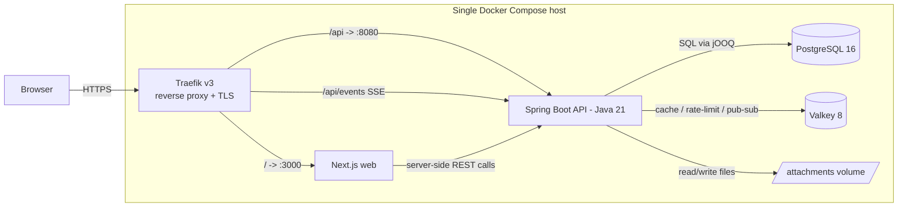
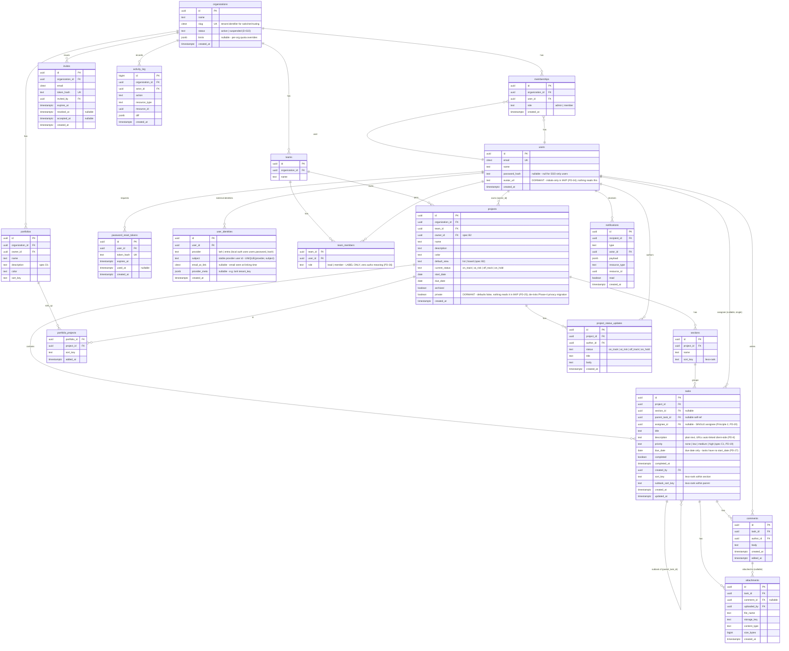

# Architecture — Self-Hosted Program & Project Management Tool

**Author:** Tech Lead · **Date:** 21 July 2026 · **Status:** v3.1 — owner-directed stack change: **API is Java / Spring Boot** (D-026), replacing NestJS. Web stays Next.js; the shared-zod contract becomes an OpenAPI-generated one; data layer is jOOQ (Apache-2.0, not Hibernate/LGPL); worker is the same Spring jar under a `worker` profile. Retains v3.0 (multi-tenant SaaS, RLS, S3, PgBouncer, scale tiers §10 — D-022…D-024) and v2.1 (Traefik/Valkey, multi-provider auth, permissive-license policy — D-018…D-021).
**Scope:** MVP (6 weeks, 3×2-week sprints) for 10–50 users, self-hosted Docker Compose.
**Product model:** Asana-style — projects/tasks/sections/boards **plus** a portfolio layer (roll-ups, portfolio timeline), which is exactly the gap that ruled out most benchmarked competitors (see `pm-tool-benchmark/research-notes.md`, Asana "Portfolio specifics").

Guiding principle: **boring, proven choices**; every decision below is tagged **[one-way door]** or **[reversible]**.

---

## 1. Architecture overview

### 1.1 Polyglot monorepo: one git repo, two build systems — [reversible]

One repository, two toolchains side by side: the web app is a **pnpm** project, the API is a **Maven** project (Java 21 LTS). No cross-language build tool ties them (Nx/Bazel would be over-engineering for two builders) — CI runs the two build lanes independently. The contract between them is the OpenAPI spec, not shared source (§1.3).

```
/
├── apps/
│   ├── web/            # Next.js (App Router, React) — pnpm
│   └── api/            # Spring Boot (Java 21) — Maven; src/main/java, Flyway migrations
├── packages/
│   └── api-client/     # GENERATED TypeScript client + types (from apps/api's OpenAPI) — pnpm
├── docker/             # Dockerfiles, traefik.yml (static config) + dynamic config
├── docker-compose.yml / docker-compose.prod.yml
└── .github/workflows/
```

**Java, not Kotlin** (owner said Java). **Maven, not Gradle** — the more boring/stable default, consistent with the "boring proven choices" principle; a Maven multi-module POM under `apps/api` splits the modules of §2.1.

### 1.2 Components and communication

- **Next.js web** — UI only. Talks to the API over REST (JSON) via the **generated `api-client`** (§1.3). No direct DB access from Next server components (one data path only; keeps auth/authz in one place).
- **Spring Boot api (Java 21)** — all business logic, validation, authz, persistence. Serves REST + one SSE endpoint for realtime. Spring Web MVC on an embedded server (Tomcat default; Undertow if we want lighter threads later — reversible).
- **PostgreSQL 16** — system of record.
- **Valkey 8** — three jobs: session/refresh-token denylist cache, rate-limit counters, pub/sub fan-out for SSE (so realtime survives running >1 api replica later). Valkey is the Linux Foundation fork of Redis 7.2 (BSD-3-Clause), Redis-protocol compatible — reached from Java via **Spring Data Redis / Lettuce** (both permissive), and used as the job queue via **Redisson** (Apache-2.0). Chosen over Redis because Redis ≥ 7.4 is RSALv2/SSPLv1 (8.x adds AGPLv3), none of which fit the permissive-only policy (Appendix: Licensing).
- **Traefik v3** — reverse proxy + TLS termination (built-in ACME/Let's Encrypt), security-header middlewares, single public entrypoint. MIT-licensed (see Appendix: Licensing).
- **Attachments volume** — local disk behind a storage interface (§5).



No message broker, no microservices, no k8s at tier T0/T1 (§10). Background work (notification fan-out, activity-log writes, retention purges, quota watermarks) runs via a **Redisson-backed reliable queue on the existing Valkey**, consumed by a **dedicated `worker` container from day 1 (D-022)** — the *same Spring Boot jar* launched with the `worker` profile (no HTTP listener; scheduled jobs via Spring `@Scheduled`) — so api replicas stay stateless request-servers and scaling either side is a compose/orchestrator knob, not a refactor.

### 1.3 The web↔api contract: OpenAPI-generated, not shared source (D-026)

With a Java API and a TypeScript web app there is no shared-source layer, so the NestJS-era "one zod schema imported by both" pillar is replaced by an **OpenAPI-first contract**, honestly a touch weaker (one source, generated clients — not one runtime object):

- The Spring API is the source of truth. `springdoc-openapi` (Apache-2.0) emits the OpenAPI 3 spec from the controllers + DTOs at build time.
- CI generates `packages/api-client` (typed TS fetch client + request/response types) from that spec via `openapi-typescript` + a typed client. The web app imports it exactly like the old shared types.
- **Drift is caught in CI**, not at runtime: a build fails if the committed client is stale versus the freshly-generated spec (regenerate-and-diff check). This is the replacement for compile-time cross-stack safety.
- Validation is now two definitions: **Jakarta Bean Validation** annotations on the Java DTOs (server, authoritative) and the generated types + light client-side checks on the web. The server is always the enforcing side; the client copy is a UX convenience.

---

## 2. Application architecture (Spring Boot)

### 2.1 Module decomposition

One Maven module (or one Spring `@Configuration`-bounded package) per product module; boundaries mirror the ERD aggregate boundaries. Spring's DI container plays the role NestJS modules did.

| Module | Owns | Notes |
|---|---|---|
| `auth` | login/logout/refresh, password-reset tokens, Spring Security filter chain, multi-provider identity framework (`IdentityProvider` port, per-provider enable/disable, `user_identities`, break-glass CLI) | §4.3 — local + Lark toggleable; Entra OIDC drops in later |
| `orgs` | organizations (tenants), memberships, org-level roles, invites (tokenized, expiring, revocable — spec A3), org lifecycle (create/suspend), org switcher context | **Multi-tenant from MVP day 1 (D-022):** many orgs per deployment; org creation gated by `SIGNUP_MODE=closed\|invite\|open` (closed for the pilot); our own org is simply tenant #1 |
| `teams` | teams, team membership | Grouping + default access scope for projects |
| `projects` | projects, sections, project membership, status colors/icons | Section CRUD lives here (sections are project-scoped) |
| `tasks` | tasks, subtasks, assignees, ordering, due dates | The hot path; owns lexo-rank reordering logic |
| `portfolios` | portfolios, portfolio_projects, project_status_updates, timeline query | Roll-up read models live here, not in `projects` |
| `collab` | comments, attachments | Attachments use `StorageProvider` (§5) |
| `notifications` | in-app notification inbox, SSE event stream | Consumes domain events; email deferred post-MVP; 90-day retention (spec F1) enforced by a nightly `@Scheduled` purge job in the worker |
| `search` | cross-entity search endpoint | MVP = `ILIKE`/`pg_trgm` prefix+substring on titles/names only (spec E2); module isolates the Phase-1 tsvector/full-text upgrade |
| `activity` | activity_log write + per-task/project feed read | Append-only; written via domain events |
| `core` (infrastructure) | jOOQ `DSLContext` config, Valkey/Redisson clients, tenant-context filter (sets the RLS GUC), config, logging, health | No business rules ever |

### 2.2 Where business rules live

- **Domain services** (`tasks/task.service.ts` etc.) hold all business rules: "completing a parent task does not auto-complete subtasks", "a project must belong to exactly one team", "a status update is project-level and any org member may post one" (spec §2.1 two-role model — corrected per PD-26). Controllers are thin: parse → authorize → delegate → shape response.
- **Cross-module communication** is via Spring's `ApplicationEventPublisher` domain events (`task.completed`, `comment.created`, `project.status_updated`); durable fan-out (notifications) hops onto the Redisson queue so it survives a crash. `notifications` and `activity` are pure consumers — no module reaches into another's internals, only its public service interface. Decoupled without inventing a bus.
- **Transactions**: any multi-table write (task move + reorder, status update + activity) is one `@Transactional` unit in the owning service; the tenant GUC is set `SET LOCAL` within that same transaction (§2.3).

### 2.3 Validation strategy

- **Edge validation**: **Jakarta Bean Validation** (`@Valid` + constraints) on the request DTOs, enforced by Spring at the controller boundary (authoritative). The web reuses the generated types plus light client-side checks for UX — the server always re-validates (§1.3).
- **Invariant validation**: DB constraints (FKs, `CHECK`, unique indexes) are the last line — e.g. unique `(project_id, portfolio_id)` in `portfolio_projects`. Never trust the app layer alone.
- **Authz**: a Spring Security filter chain authenticates the session; method-level checks (`@PreAuthorize` / a small policy service) enforce the §6 RBAC matrix, always scoped to the request's tenant. **Tenant isolation is double-walled (D-023, reverses the v2 "RLS is overkill" call now that this is a multi-tenant SaaS):** (1) every jOOQ query filters by `organization_id` in application code, and (2) **Postgres row-level security** on every tenant-owned table — a servlet filter resolves the caller's org, and a transaction-synchronized hook issues `SET LOCAL app.current_org_id = ?` at the start of each transaction (transaction-scoped, so it is **PgBouncer-safe** in transaction-pooling mode); RLS policies refuse rows from any other tenant. A bug in layer 1 becomes an empty result, never a cross-tenant leak. RLS policies live in Flyway migrations and are covered by a dedicated isolation test suite (§8).

### 2.4 Error model

RFC 9457 problem-details JSON, one global exception filter:

```json
{ "type": "https://errors.pm.internal/task-not-found",
  "title": "Task not found", "status": 404,
  "detail": "Task 7f3a… does not exist or you lack access",
  "instance": "/api/v1/tasks/7f3a…", "code": "TASK_NOT_FOUND" }
```

Implemented with Spring's `ProblemDetail` (RFC 9457 is native since Spring 6) via a `@RestControllerAdvice`. Rules: 400 validation (Bean Validation failures mapped to an `errors[]` list), 401 unauthenticated, 403 unauthorized, 404 for both missing *and* inaccessible (no existence leak), 409 conflict (stale reorder, duplicate), 422 semantic rejection, 429 rate limit. Stack traces never leave the server; every response carries an `x-request-id` echoed in logs.

---

## 3. Data model

### 3.1 ERD (MVP entities)



Notes:
- **Single assignee is schema-enforced** (PD-20): `tasks.assignee_id` is a nullable FK — one task, one assignee, per Principle 2 and spec C1. The earlier `task_assignees` M:N join is deleted; if Phase-N ever needs collaborators/followers, that is a *new* `task_followers` table with distinct semantics, not a widening of assignment.
- **Subtasks** are a self-reference (`parent_task_id`). MVP allows **one level** of nesting (enforced in service, `CHECK` deferred) — matches Asana's practical usage, avoids recursive-query complexity in views.
- **Invites and password-reset tokens** (spec A2/A3): tokens stored hashed (never plaintext), single-use, expiring (invites 14 d per spec A3, resets 1 h), revocable. Accepting an invite creates the `users` row + `memberships` row in one transaction.
- **`user_identities` ships in the MVP schema** (empty until Lark goes live in week 7, D-020): one row per external identity, `UNIQUE (provider, subject)`. Enabling a provider is a deploy + env change, never a migration. Local auth stays on `users.password_hash` (nullable — a Lark-only user has no password).
- **Tenancy shape (D-022):** users are global (one account, one email); tenancy attaches through `memberships` — one user can belong to many organizations (Slack model). Resource IDs are globally-unique UUIDv7, so web URLs need no org prefix: the resource's own `organization_id` + the caller's membership decide access, and the sidebar/org-switcher sets the browsing context. Every tenant-owned table carries `organization_id` (directly or via its aggregate root) and an RLS policy.
- **Dormant columns, explicitly inert**: `users.avatar_url` (initials-only in MVP, PD-34) and `projects.private` (defaults false; no authz branch, no RBAC row, no UI reads it — kept only to avoid a Phase-4 backfill migration, per the PD-25 ruling). CI greps assert no non-migration code references them.
- **Multi-homing tasks across projects** (Asana feature) is explicitly **out of MVP**: task belongs to exactly one project. [one-way door softened: if ever needed, introduce a `task_projects` join and backfill — schema change but mechanical.]
- `projects.current_status` is denormalized from the latest `project_status_updates` row (updated in the same transaction) so portfolio roll-up reads never join/aggregate status history.
- `notifications.payload` jsonb keeps the inbox render self-contained (no N+1 hydration).

### 3.2 Ordering scheme: fractional / lexo-rank strings — [reversible]

Boards and lists need stable drag-and-drop ordering without rewriting rows.

- `sort_key` is a base-62 **fractional index** string (à la Figma / lexo-rank). Insert-between = generate key between neighbors; only the moved row is written.
- Implementation: a small server-side utility in the `tasks` module (~100 lines, well-known algorithm; a permissive Java lexo-rank/fractional-index library or a hand-rolled port — trivial and unit-tested exhaustively per §8).
- Scopes: sections order within a project; tasks within a section (`sort_key`); subtasks within a parent (`subtask_sort_key`); projects within a portfolio.
- **Conflict handling**: two clients inserting at the same spot can generate equal keys — allowed (ties broken by `created_at, id` in the ORDER BY), and a background compaction re-spreads keys if a scope's average key length exceeds a threshold. No user-visible failure mode.
- Rejected alternatives: integer positions (O(n) rewrites, race-prone), linked lists (miserable to query).

### 3.3 Indexing

| Index | Purpose |
|---|---|
| `tasks (project_id, section_id, sort_key)` | board/list rendering — the hot query |
| `tasks (parent_task_id, subtask_sort_key)` | subtask lists |
| `tasks (project_id, completed, due_date)` | filters, "due soon" |
| `tasks (assignee_id, completed, due_date)` | "My Tasks" view (incl. Overdue-first grouping and the PD-9 owner-nudge query) |
| `comments (task_id, created_at)` | task detail pane |
| `notifications (recipient_id, read, created_at DESC)` | inbox badge + list |
| `notifications (created_at)` | nightly 90-day retention purge (spec F1) |
| `activity_log (resource_type, resource_id, created_at DESC)` | per-entity feed |
| `portfolio_projects` PK `(portfolio_id, project_id)` + `(project_id)` | roll-ups both directions |
| `project_status_updates (project_id, created_at DESC)` | latest status + staleness (≤7 d, PD-10) |
| `tasks USING GIN (title gin_trgm_ops)`; same on `projects.name`, `portfolios.name` | MVP search — `pg_trgm` substring/prefix match (spec E2); tsvector deferred to Phase 1 (PD-28) |
| `invites` unique `(token_hash)`; `password_reset_tokens` unique `(token_hash)` | single-use token lookup |
| `memberships` unique `(organization_id, user_id)`; `users` unique `citext email` | integrity |

All FKs get supporting indexes (Postgres does not auto-create them). Partial index `tasks (project_id) WHERE completed = false` if list views prove slow — measure first.

---

## 4. API design

### 4.1 REST conventions

- Base path `/api/v1`. Plural nouns, shallow nesting only where the child is meaningless without the parent: `/projects/:id/tasks`, `/tasks/:id/comments`, `/portfolios/:id/projects`. Everything else top-level (`/tasks/:id`).
- `GET` list/read, `POST` create, `PATCH` partial update (we never `PUT`), `DELETE` delete. Reorder is an explicit action: `POST /tasks/:id/move { sectionId, beforeTaskId?, afterTaskId? }` — server computes the sort_key so clients can't corrupt ordering.
- Responses are enveloped: `{ "data": …, "meta": { … } }`. Timestamps ISO-8601 UTC. IDs are UUIDv7 (time-sortable, index-friendly).
- **URL/ID ruling (PD-29, one scheme across all three docs):** UUIDv7 is the only identifier — in the API and in web URLs. Web routes: `/tasks/:id`, `/projects/:id`, `/portfolios/:id`, with `?task=:id` as the side-peek overlay param. **No vanity slugs** (`PRJ-8fk2` etc.) in MVP — a slug table is Phase-1 polish, not week-1 routing. Deep links (notifications, search results, Teams pastes) all resolve through these canonical paths.

### 4.2 Pagination

**Cursor-based** everywhere (`?cursor=…&limit=50`, default 50, max 200), cursor = opaque base64 of `(sort_key || created_at, id)`. Offset pagination is banned — it breaks under concurrent inserts, which is exactly the board use case. `meta.nextCursor` null-terminates.

### 4.3 Auth: a multi-provider framework — local + Lark, each independently toggleable; Entra ready (D-020)

**Session model (provider-independent).** Whoever authenticates you, *we* mint the same first-party session: short-lived access JWT (15 min, httpOnly Secure SameSite=Lax cookie) + rotating refresh token (7 days, httpOnly cookie, denylist in Valkey on logout/rotation). No localStorage tokens (XSS). Guards, RBAC, SSE auth, and the frontend never learn which provider was used; provider tokens are consumed at login time only and never passed downstream.

**Provider framework (built in MVP Sprint 1; only the Lark implementation is deferred to week 7):**

1. **`IdentityProvider` port.** One Java interface — `IdentityClaims authenticate(input)` returning `{ provider, subject, email, emailVerified, name }`. Implementations: `LocalPasswordProvider` (argon2id via Spring Security's `Argon2PasswordEncoder`, MVP), `LarkOAuthProvider` (week 7, first post-MVP item), `EntraOidcProvider` (Phase 3, via Spring Security OAuth2 Client). Zero changes to session issuance, the security filter chain, or any downstream module per provider.
2. **Per-provider enable/disable via environment config** — the owner's requirement:
   - `AUTH_LOCAL_ENABLED` (default `true`) — email/password, invites, admin reset links.
   - `AUTH_LARK_ENABLED` (default `false`) — requires `LARK_APP_ID` + `LARK_APP_SECRET`; `LARK_BASE_URL` defaults to `https://open.larksuite.com` (set the Feishu domain `https://open.feishu.cn` for CN tenants — same provider code, different base URL).
   - **Boot validation fails fast** if zero providers are enabled, or an enabled provider is missing credentials — clear startup error, documented in the runbook.
   - `GET /api/v1/auth/providers` returns the enabled set; the login page renders only what is enabled (password form, "Continue with Lark" button, or both). Toggling is config + restart, not a settings screen (an admin UI for this is Phase-4 polish at most).
3. **Identity is separate from user.** External identities live in `user_identities (provider, subject — unique)`, in the MVP schema from day 1 (§3.1); `users.password_hash` is nullable. Resolution order in `IdentityService`: (a) `(provider, subject)` match → sign in; (b) else verified-email match to an existing **active** user → link the identity (recorded in `activity_log`) and sign in; (c) else apply the provisioning policy: `AUTH_LARK_PROVISIONING=invite_only` (default) rejects with "ask an admin for an invite" — `auto` JIT-creates a member, optionally fenced by `AUTH_ALLOWED_EMAIL_DOMAINS` and/or `LARK_ALLOWED_TENANT_KEY`.
4. **Lockout safety (consequence of toggles).** Disabling local auth while Lark is misconfigured or down must never brick the install: a break-glass CLI on the VM (`java -jar app.jar auth-recover`, a Spring `ApplicationRunner` guarded by a CLI profile) re-enables local auth and/or mints an admin password-reset link, bypassing HTTP entirely. Startup logs a warning if local auth is disabled and any active admin has no linked external identity. Documented in the runbook next to the restore drill.

**`LarkOAuthProvider` specifics.** OAuth 2.0 authorization-code flow against the configured base domain: redirect to Lark's authorize endpoint with a session-bound `state` (CSRF); the callback exchanges the code server-side at Lark's OAuth token endpoint (client secret never leaves the API); profile fetched from the authen user-info endpoint. Stable subject = `union_id` (fallback `open_id`); `tenant_key` stored in `provider_meta` and optionally enforced. Note: the user's email is only present if the Lark app is granted the email scope in the Lark admin console — without it, email-based auto-linking is impossible and `invite_only` + explicit linking applies. Endpoints and scopes are configuration, so Lark (larksuite.com) and Feishu (feishu.cn) tenants use the same code path.

**The drop-in guarantee** stays, now stated for all providers: adding or toggling a provider touches only the api's `auth` module (`apps/api/src/main/java/.../auth/**`) and the login page — kept honest by an acceptance test.

### 4.4 Realtime: SSE for MVP — [reversible]

Decision: **Server-Sent Events**, one endpoint `GET /api/v1/events` (auth via session cookie), backed by Valkey pub/sub. Client subscribes to the entities it has open (project board, task, notifications badge); events are thin (`{ type: "task.updated", taskId, projectId }`) and the client refetches — no state-sync protocol to design or debug.

Why not the alternatives, against a 6-week clock:
- **Polling**: simplest, but 50 users × per-board polling gives worse UX (multi-second staleness) for barely less work than SSE — Spring MVC returns SSE natively (`SseEmitter` / a `text/event-stream` `Flux`), fed by a Valkey pub/sub listener, so SSE is ~2 days.
- **WebSocket**: bidirectional transport we don't need (all writes go through REST), plus gateway lifecycle, reconnect/backoff, and proxy config to get right. Deferred; if we ever need client→server streaming (live cursors, presence), the Valkey pub/sub backbone already exists and the client swap is contained in one hook.

Fallback: SSE auto-reconnects natively; on top we refetch-on-window-focus (React Query default), so a dropped stream degrades to slightly-stale, never wrong.

**Build-order rule (PD-4, formalizing risk #4's mitigation as schedule):** SSE is the *last* Sprint-3 item, started only after board, portfolio roll-up, and notifications are demo-complete. Pre-agreed cut line: if week 5 opens with any red feature, SSE is dropped from MVP without a meeting and optimistic-update + refetch-on-focus ships as the realtime story (AC0.2 is satisfiable that way). The Valkey pub/sub plumbing costs nothing to keep for a Phase-1 revival.

### 4.5 API docs

`springdoc-openapi` serves Swagger UI at `/api/docs` (dev only) and the spec that generates `packages/api-client` (§1.3) — on from day 1, consumed by the web build and the Designer.

---

## 5. File storage: S3-compatible in production behind the `StorageProvider` port — [revised per D-022]

**Production: S3-compatible object storage from day 1** (`S3Storage` impl; any S3 API — a cloud bucket, or SeaweedFS if it must stay on-VM — never MinIO, per the licensing appendix). Local disk is wrong for a multi-tenant SaaS: it pins the API to one node (blocking replicas), grows a single volume across tenants, and complicates per-tenant export. Keys laid out `orgId/attachmentId/filename` so per-tenant lifecycle (quota, export, delete) is a prefix operation. **Dev/test: `LocalDiskStorage`** keeps the loop fast; the provider is config-selected.

Swappability remains enforced, not hoped for:
- `collab` depends only on `StorageProvider { put(stream, meta) → storageKey; getStream(storageKey); delete(storageKey); }`. `S3Storage` is the production impl (D-022); `LocalDiskStorage` serves dev/test. `attachments.storage_key` is provider-agnostic.
- Downloads always stream **through the API** (authz + RLS check per request) — never direct file URLs. Switching to S3 presigned URLs later is an optimization inside the provider, not an API change.
- Limits: 25 MB/file, allowlist-by-extension + sniffed content-type, **per-org quota enforced** (default 10 GB, override via `organizations.limits`, hard-stop with a clear error + admin warning at 80%). Files served with `Content-Disposition: attachment` + `X-Content-Type-Options: nosniff` (no stored-XSS via uploaded HTML/SVG).

---

## 6. Non-functionals (10–50 users)

### 6.1 Performance targets

| Metric | Target |
|---|---|
| API p95 (reads: board, list, portfolio) | < 300 ms |
| API p95 (writes: task CRUD, reorder) | < 200 ms |
| Portfolio timeline (25 projects) | < 500 ms |
| Web LCP on board view (intranet) | < 2.0 s |
| SSE event → UI refresh | < 2 s |
| Concurrent users | 50 (design), tested to 100 via k6 smoke |

These are comfortable on one 4 vCPU / 8 GB VM; we assert them in a Sprint-3 k6 run, not continuously.

### 6.2 Backup / restore

- **Nightly `pg_dump -Fc`** (custom format) at 02:00 via a `backup` sidecar container; kept 14 daily + 8 weekly, written to a second disk/mount (and, recommended, synced off-VM — owner's call, e.g. rclone to any SMB/Azure blob).
- **Attachments volume**: nightly `restic` (or tar) snapshot to the same backup target, same retention.
- **Weekly VM-level snapshot** if the hypervisor supports it (belt and braces).
- **Restore is rehearsed, not assumed**: the runbook (§7.4) includes a restore drill executed once before go-live and quarterly after (`pg_restore` into a scratch container + checksum a known row count).
- RPO 24 h / RTO 2 h — acceptable for an internal tool; document it so nobody assumes better.

### 6.3 Logging & observability — deliberately lean

- **Structured JSON logs** (pino) from api, worker, and web, one line per request: `x-request-id`, user id, **organization_id**, route, status, duration. `docker compose logs` + `jq` is the MVP log UI; ship to Loki at tier T2 (§10).
- **Metrics (D-022)**: `/metrics` Prometheus endpoint (prom-client) on api + worker — request rate/latency/error by route, queue depth, SSE connection count, per-org top-talkers. Scraped by nothing at T0 (curl-able for debugging); Prometheus+Grafana attach at T1–T2 without app changes.
- **Healthchecks**: `/healthz` (liveness) and `/readyz` (checks Postgres + Valkey) on the API; Docker `HEALTHCHECK` on every service; Traefik serves a static maintenance page (errors middleware) if api is down.
- **Error tracking**: self-hostable GlitchTip *or* just log-based for MVP — decision left to Sprint 3 slack; not on the critical path.
- Explicitly **not** doing: metrics stack (Prometheus/Grafana), tracing, k8s. Revisit at >100 users.

### 6.4 Security

- **OWASP basics**: argon2id password hashing; Jakarta Bean Validation on every input; jOOQ bind-parameterized SQL throughout (no string-built SQL — the roll-up aggregate and Phase-2 trigram search use bound params); httpOnly SameSite cookies + CSRF double-submit token on state-changing routes; security headers via Traefik middlewares (HSTS, X-Frame-Options DENY, nosniff) with CSP (`default-src 'self'`) set by the apps; OAuth callbacks protected by session-bound `state` (§4.3); dependency audit in CI (`pnpm audit` + Maven OWASP dependency-check + Dependabot).
- **Rate limiting & noisy-neighbor controls (D-022)**: a Valkey-backed limiter (Bucket4j with its Redis/Redisson backend, Apache-2.0, or Resilience4j) — per-user 100 req/min **and per-org aggregate caps** (default 1,000 req/min, override via `organizations.limits`) so one tenant cannot starve the rest; `POST /auth/login` 5/min/IP with exponential lockout (OAuth callback endpoints included); uploads 20/hour/user. Per-org quotas: storage (§5), and soft row-count watermarks (projects/tasks) logged for capacity planning.
- **Secrets**: `.env.prod` file on the VM, `chmod 600`, never in git (git-secrets hook in CI); rotated by redeploy. Docker/Swarm secrets are overkill for one VM [reversible].
- **RBAC matrix (MVP)** — exactly **two org roles** (spec §2.1); "lead" is a persona, not a permission (PD-26); guest role is post-MVP. All projects are org-visible — no privacy in MVP (PD-25; the dormant `projects.private` column has no row here and no authz branch):

| Capability | Org **Admin** | Org **Member** |
|---|---|---|
| Manage org, users, teams, invites | ✔ | ✖ |
| Create project / portfolio | ✔ | ✔ |
| View any project, portfolio & tasks | ✔ | ✔ |
| Create/edit tasks, comment, attach | ✔ | ✔ |
| Edit/archive project, post status update | ✔ | ✔ (any member — not gated to owner/lead) |
| Manage portfolio contents | ✔ | ✔ |
| Delete org data / restore backups | ✔ | ✖ |

`team_members.role` (`lead|member`) is a **display label only** — it appears in the UI, is read by zero guards and zero policies, and is documented as such in `PoliciesGuard`. The RBAC table-driven integration test (§8) asserts the whole matrix, including that a plain member can edit projects and post status updates.

---

## 7. Deployment: Docker Compose

### 7.1 Services

| Service | Image | Notes |
|---|---|---|
| `traefik` | traefik:v3 | 80/443 published; auto-TLS via built-in ACME (Let's Encrypt) or internal CA for intranet-only; `acme.json` on a volume; dashboard disabled in prod; the **only** service with published ports |
| `web` | our Next.js image (multi-stage, standalone output) | |
| `api` | our Spring Boot image (multi-stage: Maven build → `eclipse-temurin:21-jre` runtime, layered jar) | runs Flyway migrations on startup (Spring Boot auto-runs them) |
| `postgres` | postgres:16 | volume `pgdata`; not exposed to host |
| `pgbouncer` | pgbouncer (edoburu image or equivalent) | transaction pooling between api replicas and Postgres — required the moment `api` scales past one replica; present from day 1 so it's exercised, not theoretical |
| `valkey` | valkey/valkey:8 | AOF on; not exposed; Redis-protocol compatible (BSD-3) |
| `worker` | same api image, `worker` Spring profile | Redisson queue consumers + `@Scheduled` jobs (notification fan-out, purge, quota watermarks) extracted from the api process (D-022) — api replicas stay purely request-serving |
| `backup` | postgres:16 + cron script | nightly pg_dump + attachment snapshot (§6.2) |

**Traefik over Caddy and nginx** — [reversible; revised per D-018]: the original draft chose Caddy for zero-config auto-TLS. The owner set a **permissive-license-only policy** for every shipped runtime component, to keep future commercialization unencumbered. For accuracy: Caddy v2 itself is Apache-2.0 (commercial use is permitted — the historical restriction applied to v1's official binaries), but Traefik is MIT, equally capable here (built-in ACME auto-TLS, header middlewares, native Docker provider), and swapping now removes any diligence-time discussion entirely. nginx (BSD-2) + certbot remains the maximally-boring fallback, at the cost of a second moving part (cert renewal + reload orchestration) — adopt it only if Traefik misbehaves. Config lives in `docker/traefik.yml` + one dynamic file; routing via container labels.

### 7.2 Data access: jOOQ + Flyway (not Hibernate/JPA) — [semi one-way door; chosen deliberately]

**jOOQ over Hibernate/Spring Data JPA**, for three reasons that line up with this project: (1) **licensing** — jOOQ's open-source edition is **Apache-2.0 against PostgreSQL**, whereas Hibernate ORM is **LGPL-2.1**; the permissive-only policy (D-021) makes jOOQ the clean choice and keeps a copyleft-family lib out of the shipped stack. (2) **SQL control** — the differentiating work here is explicit SQL (the portfolio roll-up aggregate, the RLS `SET LOCAL` per transaction, `pg_trgm` search in Phase 2); jOOQ gives compile-time-checked, typed SQL generated from the schema, which fits far better than an ORM that wants to hide the SQL. (3) **no lazy-loading / N+1 surprises** — every query is explicit, which is exactly the discipline the roll-up perf risk (R5) needs. **Flyway** (Apache-2.0) owns versioned SQL migrations — including the RLS policies — with an idempotent, CI-testable deploy; Spring Boot runs pending migrations on startup. jOOQ's typed classes are code-generated from the migrated schema in the Maven build. Cost accepted: more hand-written SQL than an ORM (that's the point), and the jOOQ codegen step in the build.

### 7.3 Environments

- **dev**: `docker-compose.yml` runs postgres/valkey only; web runs on the host (`pnpm dev`) and api via `./mvnw spring-boot:run` (Spring DevTools hot restart). Seed script creates demo org/projects/portfolio.
- **prod**: `docker-compose.prod.yml` (all services), `.env.prod` for secrets, images built in CI and pulled by tag (git SHA) — the VM never builds.

### 7.4 Zero-to-running runbook (outline — full doc in `docs/runbook.md`)

1. Provision VM (Ubuntu 24.04, 4 vCPU/8 GB/100 GB + backup disk); install Docker + compose plugin.
2. DNS A record → VM; open 80/443 (intranet firewall rules as required).
3. `git clone` repo (or copy release bundle); `cp .env.prod.example .env.prod`; fill secrets (`openssl rand` helpers documented).
4. `docker compose -f docker-compose.prod.yml up -d` — api entrypoint runs migrations; Traefik obtains certs via ACME.
5. `docker compose exec api java -jar app.jar seed-admin` → first admin user.
6. Verify `/readyz`, log in, create org. 7. Run restore drill once (§6.2). Target: **under 1 hour**.

### 7.5 Upgrade strategy

- Release = git tag → CI builds/pushes images tagged with SHA + version.
- Upgrade = `git pull && docker compose pull && docker compose up -d`. Spring Boot runs pending Flyway migrations before serving; **migrations must be backward-compatible one version** (expand → migrate → contract discipline) so a rollback is just redeploying the previous tag. Destructive migrations require a pre-upgrade backup checkpoint (scripted).
- Brief downtime (<1 min) during `up -d` is acceptable for an internal tool; no blue/green.

---

## 8. Testing strategy (ruthless 6-week cut)

| Layer | Tooling | Mandatory in 6 weeks | Deferred |
|---|---|---|---|
| **Unit** | JUnit 5 | Ordering utils (fractional index — exhaustive, incl. tie/rebalance), authz policies, roll-up calculators, IdentityService | Broad coverage targets — no % gate |
| **Integration (API)** | JUnit 5 + **Testcontainers** (real Postgres+Valkey; Testcontainers is JVM-native) + Spring `MockMvc`/`WebTestClient` | The contract per module: auth flows (login, invite accept, password reset, provider-toggle boot validation), task CRUD + **move/reorder races**, portfolio roll-up + timeline query, RBAC matrix as a parameterized test (incl. any-member-can-post-status), pagination cursors, **tenant-isolation suite (D-023): two seeded orgs, every endpoint asserted to return/mutate only the caller's tenant, plus a "layer-1 bug drill" that bypasses the app filter and proves RLS alone blocks the leak** | Notification fan-out edge cases |
| **E2E** | Playwright (Node runner against the running web app — language-agnostic at this layer) | **One smoke path**: login → create project → add sections/tasks → drag reorder → assign → comment+attach → create portfolio → see roll-up + timeline → status update appears | Cross-browser, visual regression, mobile |
| **Load** | k6 | One Sprint-3 script: 100 VUs on board read + reorder + portfolio timeline, assert §6.1 | Sustained soak |

Principles: integration tests against a **real** Postgres (Testcontainers) are the backbone — mocked-DB tests would miss exactly our risk areas (ordering, constraints, roll-up SQL, and RLS itself). E2E stays at one smoke flow; it's a tripwire, not a spec.

**CI (GitHub Actions)**, two lanes per PR: **api lane** (`mvn verify` — spotless/checkstyle + unit + Testcontainers integration + jar build) and **web lane** (lint + typecheck + build + `pnpm audit`), then a shared **Playwright smoke** against the compose stack, an **api-client drift check** (regenerate from the OpenAPI spec and fail on diff — §1.3), and the **license gate** — now covering both npm (license-checker) and Maven (`license-maven-plugin`) against the Appendix allowlist, so a copyleft/source-available dependency on either side fails the build. `main` builds and pushes release images. A scheduled weekly job runs `prisma migrate deploy` against a restored copy of the latest prod dump — migration + backup verification in one.

---

## 9. Technical risk register (top 5)

| # | Risk | Likelihood / Impact | Mitigation |
|---|---|---|---|
| 1 | **Board ordering conflicts** — concurrent drags produce duplicate/exhausted fractional keys, items "jump" | Med / Med | Server-computed keys only (`/move` API); ties tolerated with deterministic tie-break; background rebalance; dedicated race-condition integration tests; SSE refresh makes the other client converge in <2 s |
| 2 | **Portfolio timeline/roll-up query cost** — N projects × M tasks aggregates get slow or, worse, get built as N+1 in the app | Med / High (it's the differentiating feature) | Single SQL aggregate per portfolio (raw, indexed, tested with seeded 50-project/10k-task dataset in Sprint 2 — not Sprint 3); denormalized `projects.current_status`; k6 assertion < 500 ms; fallback: 60 s Valkey cache on the roll-up read (one flag) |
| 3 | **Attachment storage growth / backup bloat** — volume outgrows disk or makes backups slow | Med / Med | 25 MB/file cap + per-org quota + admin usage view from day 1; attachments on separate mount; `StorageProvider` seam means MinIO/S3 migration is a copy script + config flip, no API change |
| 4 | **Realtime scope creep** — SSE turns into a half-built state-sync layer eating Sprint 2/3 | High / High (timeline risk) | Events are notify-only (client refetches); hard scope: task/board/notification events only; polling-on-focus already works without SSE, so SSE can be cut in extremis without losing correctness |
| 5 | **Single-VM data loss / failed restore** — backups exist but don't restore | Low / Critical | `pg_dump` + volume snapshot + off-VM sync (§6.2); restore drill pre-go-live and quarterly; weekly CI job restores latest dump and runs migrations against it — a corrupt backup is detected within 7 days, not at disaster time |
| 6 | **Cross-tenant data leak** — a missed org filter or RLS policy gap exposes one tenant's data to another (the SaaS-killing defect class) | Low / **Critical** | Double-wall isolation (app filter + RLS, §2.3); RLS policies generated per table in migrations, reviewed as a set; tenant-isolation integration suite incl. the layer-1 bug drill (§8) runs on every PR; new tables cannot merge without an RLS policy (CI grep on migrations); `/metrics` per-org counters make anomalous cross-org access patterns visible |

Watchlist (not top-6): jOOQ codegen kept in sync with Flyway migrations (build regenerates; drift fails compile); Next.js / Spring Boot version churn (pin, upgrade in Sprint gaps); auth-seam erosion (acceptance test in §4.3 keeps SSO honest); **RLS + PgBouncer interaction** (transaction pooling requires the GUC be set with `SET LOCAL` inside each transaction, never per-session — enforced by the transaction-synchronized hook in `core` and covered by the isolation suite); OpenAPI-client drift (CI regenerate-and-diff check).

---

## 10. Multi-tenant SaaS: scale invariants & tier roadmap (D-022)

### 10.1 Invariants — what the MVP must never do wrong

These are the rules that keep every scale tier reachable without a rewrite. They are cheap to hold now and ruinous to retrofit:

1. **Stateless api & worker** — no request state outside Postgres/Valkey/object storage; any replica can serve any request (sessions are JWT cookies; SSE fan-out rides Valkey pub/sub).
2. **Every tenant-owned row carries `organization_id` + an RLS policy**; the GUC is set per transaction (PgBouncer-safe).
3. **No local disk in prod** — attachments in object storage (§5); containers are disposable.
4. **All DB access through PgBouncer**; connection counts are a pool config, not a per-replica multiplication.
5. **Cursor pagination only** (already banned offset) — stable under concurrent tenants.
6. **Background work only via the queue** — never in request handlers; workers scale independently.
7. **Migrations expand → migrate → contract** — always one-version backward compatible, so rolling deploys work at every tier.
8. **Config via env only** (12-factor) — the same images run compose today and an orchestrator later.
9. **Per-org limits enforced at the edge** (rate, storage, watermarks) — noisy neighbors are contained by default.

### 10.2 Scale tiers — each with a trigger, none started early

| Tier | Shape | Serves (rule of thumb) | Trigger to move up |
|---|---|---|---|
| **T0 — now (MVP/pilot)** | One VM, Docker Compose: traefik, web, api, worker, pgbouncer, postgres, valkey, backup; S3 bucket for files | Tens of orgs, ~500 total users | Sustained p95 > targets after vertical bump, or first paying external tenant |
| **T1 — split & replicate** | Same compose topology, bigger/second VM: 2–3 api replicas behind Traefik, managed PostgreSQL (or dedicated DB VM with replication + PITR), Prometheus/Grafana attach to `/metrics` | Hundreds of orgs, ~5k users | Ops toil (deploys, capacity juggling) exceeds ~½ day/week, or availability SLO demanded by customers |
| **T2 — orchestrate** | Kubernetes or a managed container platform: HPA on api/worker, managed Postgres + read replica (roll-up reads), CDN for static assets, Loki logs, subdomain-per-org with wildcard TLS, status page | Thousands of orgs | Multi-region data-residency or SLA requirements from customers |
| **T3 — regionalize** | Per-region cells (EU/ME/APAC), tenant-pinned-to-cell (no cross-region DB), global edge routing | As demanded | — |

Postgres remains a single logical primary per cell through T2 — at this workload (I/O-light CRUD, 10k-task orgs) vertical Postgres + a read replica outlasts any realistic tenant count before T3; sharding is deliberately absent from this roadmap.

### 10.3 Explicitly deferred (commercial-launch checklist, not architecture)

Billing/entitlements (plan tiers mapped to `organizations.limits`), self-serve signup opening (`SIGNUP_MODE=open`), per-tenant data export/deletion self-service (GDPR-shaped), uptime SLO + status page, penetration test, terms/DPA. These gate the **commercial launch phase** in the delivery plan — they are product/ops work on top of this architecture, not changes to it.

---

## 11. Topology: modular monolith now, microservices deliberately declined (D-027)

Cairn ships as a **modular monolith** — one Spring Boot `api` deployable — plus the already-split **worker** (same jar, `worker` profile). Not microservices, and not by omission: the trade was evaluated and the monolith wins decisively for *this* system through scale tiers T0–T2 (§10). The api/worker split is the only decomposition, made along a proven seam (request-serving vs background work) for independent scaling — and it is the *template* for any future split.

### 11.1 Why microservices lose here — tied to our own invariants, not dogma

- **Tenant isolation is our crown-jewel invariant (D-023) and is simplest and safest in one datastore.** One Postgres + RLS + the per-transaction GUC is the whole story. Microservices force either a **shared DB across services** (the distributed-monolith anti-pattern) or **a DB per service**, each needing its own org-context plumbing and RLS policies — multiplying the surface area for the one defect class that kills a SaaS (cross-tenant leak, R9). Decomposition makes our most important property *harder and riskier*.
- **Core writes are single transactions today.** "Task move + reorder", "status update → activity → notification enqueue" are one `@Transactional` unit. Across service boundaries they become sagas / eventual consistency — real complexity and new failure modes for zero benefit at 10–50 users per tenant.
- **The differentiating read is one SQL aggregate.** The portfolio roll-up (R5) joins projects, tasks, and latest status in a single indexed query. Split those into separate services with separate stores and it degrades into API composition / N+1 — worsening the exact feature Cairn exists for.
- **Operational reality.** T0 is one VM on Docker Compose, built by one implementer to a 6-week MVP. N services = N pipelines, service discovery, inter-service authn, distributed tracing — cost with no payoff. Vertical Postgres + api replicas behind PgBouncer (T1) and HPA (T2) carry this I/O-light workload far past any realistic tenant count before decomposition is even a question.
- **Build model.** Claude Code builds in small vertical slices verified end-to-end (docs/05); microservices cut horizontally against that, spreading context and integration surface and slowing verification.

### 11.2 What we do keep — so the option stays open (modular-monolith discipline)

Already enforced in §2 and `CLAUDE.md`: hard module boundaries; no module reaches into another's internals (only its public service interface); cross-module comms via `ApplicationEventPublisher`, with durable fan-out already riding the Valkey queue; stateless api. This is what prevents the "big ball of mud" failure mode of a lazy monolith and keeps a clean carve-out possible.

### 11.3 Extraction triggers — any one re-opens the question (as a decision-log entry)

Extract **one hot component** along its existing seam; never "decompose into microservices" wholesale. First candidates, in likelihood order: **notifications/fan-out**, **search** (Phase 2, once it gains its own index/engine), **attachments/media** processing. Triggers:

1. A component with a genuinely different scaling or resource profile that is starving the api (measured, not assumed).
2. Independent team ownership (we have none today).
3. A fault-isolation requirement (a subsystem crash must not take the whole app down).
4. Per-component data residency or compliance boundary.

None hold today. If Cairn becomes a multi-product platform with several engineering teams, revisit — until then, splitting a module into a service is a **release-blocker-level change** that requires a decision-log trigger.

---

## Appendix: decision summary

| Decision | Choice | Door |
|---|---|---|
| API language/framework | **Java 21 / Spring Boot** (Maven) — D-026 | semi one-way (the rewrite this doc just absorbed) |
| Web | Next.js / React (TypeScript) — unchanged | — |
| web↔api contract | OpenAPI-generated TS client (`springdoc-openapi` → `packages/api-client`), CI drift check — D-026 | reversible |
| Repo | polyglot monorepo: pnpm (web) + Maven (api) in one git repo | reversible |
| Data access | **jOOQ** (Apache-2.0) + Flyway migrations — D-026 | semi one-way |
| Ordering | fractional indexing (lexo-rank strings), server-computed | reversible |
| Auth | JWT cookie sessions + multi-provider `IdentityProvider` framework (Spring Security); local + Lark toggleable via env; Entra later (D-020) | designed for provider drop-in |
| Realtime | SSE (Spring `SseEmitter`) + Valkey pub/sub, notify-then-refetch | reversible (WS later) |
| Tenancy | multi-tenant from day 1: global users + per-org memberships, `organization_id` + **RLS on every tenant table** (GUC via `SET LOCAL`), per-org quotas, `SIGNUP_MODE` gate — D-022/D-023 | one-way (good) — retrofitting tenancy is the rewrite we refuse |
| Attachments | S3-compatible object storage in prod behind `StorageProvider` (local disk in dev) — D-024 | reversible per provider |
| DB pooling | PgBouncer (transaction mode) from day 1 | reversible |
| Workers | same Spring jar, `worker` profile; Redisson queue + `@Scheduled` — D-022 | reversible |
| Proxy/TLS | Traefik v3 (MIT) — D-018 | reversible (nginx + certbot fallback) |
| Cache/queue/pub-sub | Valkey 8 (BSD-3), Redis-protocol drop-in — D-019 | reversible |
| License policy | permissive-only runtime stack, CI-gated allowlist — D-021 | policy (see licensing appendix) |
| Scale path | tiered T0→T3 with explicit triggers (§10); no k8s/sharding before their tier | policy |
| Topology | **modular monolith** (one Spring Boot api) + worker; **microservices declined** — extraction seams kept, triggers named (§11) — D-027 | reversible by carving one component along its seam |
| Multi-homing tasks | excluded from MVP | additive migration if needed |
| Pagination | cursor-based only | one-way (good) |
| IDs / URLs | UUIDv7 everywhere; web `/tasks/:id` + `?task=` overlay; no slugs | one-way (good) |
| Task assignment | single nullable `assignee_id` FK (no M:N) | one-way by design (Principle 2) |
| MVP search | `ILIKE`/`pg_trgm` on titles/names | reversible (tsvector in Phase 1) |
| SSE scheduling | last Sprint-3 item, pre-agreed cut to refetch-on-focus | schedule rule (PD-4) |

---

## Appendix: Licensing & commercialization audit (D-018, D-019, D-021)

**Policy (owner-set, 20 Jul 2026):** every component that ships as part of the Cairn runtime must carry a permissive license — MIT, BSD, Apache-2.0, ISC, PostgreSQL, OFL, CC0 class. No **strong copyleft (GPL/AGPL)** and no **source-available (SSPL, RSAL, BUSL, FSL, Elastic)** in shipped components. Enforced by a **CI license gate** on both build systems (npm via license-checker, Maven via `license-maven-plugin`).

**Java raises two nuances the Node stack did not — resolved explicitly (D-026):**
- **The JVM itself is GPL-lineage.** Every mainstream JDK — Temurin/Adoptium, OpenJDK, GraalVM CE — is **GPLv2 with the Classpath Exception (CE)**. The CE exists precisely so that linking your application to the JVM/class libraries does **not** propagate the GPL to your code; proprietary and commercial distribution on OpenJDK is standard and unambiguous. There is *no* fully-permissive mainstream JDK, so choosing Java means accepting a GPL-**with-CE** runtime. This is a deliberate, documented exception to the "MIT/BSD/Apache only" ideal — narrow (the runtime, not our deps) and industry-normal. (Oracle's own JDK build carries commercial terms — we do **not** use it; Temurin only.)
- **Weak/file-level copyleft (LGPL, EPL, MPL, CDDL) appears in the Java ecosystem.** These permit proprietary distribution when used as-is via linking, but to honor the spirit of the policy we **prefer a permissive alternative whenever one exists** and allow weak-copyleft only where unavoidable and clearly bounded (e.g. some Jakarta/JUnit artifacts are EPL-2.0 — mostly test-scope). The CI Maven gate flags GPL/AGPL/SSPL/etc. as failures and LGPL/EPL/MPL as **warnings to review**, not silent passes.

### Shipped runtime components — permissive (JVM excepted as above)

| Component | License | Note |
|---|---|---|
| **Java runtime — Eclipse Temurin 21 (OpenJDK)** | **GPLv2 + Classpath Exception** | The documented exception above; CE permits proprietary distribution |
| **Spring Boot / Spring Framework / Spring Security** | Apache-2.0 | The API framework (D-026) |
| **jOOQ (open-source edition, for PostgreSQL)** | **Apache-2.0** | Chosen over Hibernate specifically to stay permissive (§7.2) |
| **Flyway (community)** | Apache-2.0 | Migrations |
| Redisson / Lettuce (Valkey clients + queue) | Apache-2.0 | |
| springdoc-openapi, Bucket4j, argon2 (Spring Security) | Apache-2.0 | Contract gen, rate limiting, password hashing |
| Next.js / React, Node.js (web build/runtime) | MIT / MIT-style | Web app unchanged |
| generated `api-client` (openapi-typescript) | MIT | |
| PostgreSQL 16 | PostgreSQL License (permissive) | |
| **Valkey 8** | **BSD-3-Clause** | Replaces Redis (D-019) |
| **Traefik v3** | **MIT** | Replaces Caddy (D-018) |
| anime.js v4 | MIT | Web motion |
| Inter / JetBrains Mono | SIL OFL 1.1 | Bundling in a commercial product is permitted; fonts not sold standalone |
| Docker Engine (on the VM) | Apache-2.0 | Server-side engine unencumbered |

### Deliberately avoided or swapped

| Component | License problem | Our position |
|---|---|---|
| **Hibernate ORM / Spring Data JPA** | LGPL-2.1 (weak copyleft) | Use **jOOQ (Apache-2.0)** instead (§7.2, D-026) — also the better fit for our explicit-SQL needs |
| **Oracle JDK** | Commercial (Oracle terms) | Use **Temurin/OpenJDK** (GPLv2+CE) only |
| **Redis ≥ 7.4** | RSALv2 / SSPLv1 (8.x offers AGPLv3) | Swapped to Valkey (D-019) |
| **Caddy** | None in fact — v2 is Apache-2.0 | Swapped to MIT Traefik anyway under the blanket policy (D-018) |
| **MinIO** | AGPLv3 | SeaweedFS (Apache-2.0) or a managed S3 bucket via the `StorageProvider` port — never MinIO |
| **Sentry (server)** | FSL (source-available) | GlitchTip (MIT) if error tracking is adopted (§6.3) |

### Dev/build-only tooling (not distributed — exempt, tracked)

| Tool | License | Note |
|---|---|---|
| Maven / Gradle wrapper, JUnit 5 | Apache-2.0 / EPL-2.0 | Build + test scope; not shipped |
| k6 (load test) | AGPLv3 | Runs against the app from outside; never shipped |
| Playwright / pnpm / eslint | Apache-2.0 / MIT | Fine |
| Docker Desktop (dev laptops) | Paid tier for large orgs (>250 employees & >$10M revenue) | Linux Engine/CLI is Apache-2.0; noted for the commercialization file |

**If Cairn itself is commercialized:** shipping on a GPL+**CE** JVM does **not** constrain Cairn's own license — the Classpath Exception is designed exactly for this, so proprietary, dual-license, or open-core all remain open. The only genuine change from the Node stack is that "100% MIT/BSD/Apache" becomes "MIT/BSD/Apache application deps on a GPL+CE runtime." Keep this appendix current; the two-system CI gate keeps dependencies honest.

---

## Appendix: Feedback disposition (PMO review, PD findings relevant to this document)

| PD | Disposition | Note |
|---|---|---|
| PD-4 | **Applied** | SSE build-order rule + pre-agreed cut line added to §4.4 |
| PD-8 / PD-24 | **Applied** | `tasks.description` annotated plain text + client-side auto-link; no rich-text serialization anywhere in the schema |
| PD-9 | **Applied** | Owner-nudge query covered by the `project_status_updates (project_id, created_at DESC)` and My-Tasks indexes; no cron/SMTP needed |
| PD-10 | **Applied** | Staleness index note references the 7-day threshold |
| PD-17 | **No change needed** | Architecture already carries the spec enum `on_track/at_risk/off_track/on_hold`; noted for the record vs design |
| PD-19 | **Applied** | `tasks.priority` (`none/low/medium/high`) added to ERD |
| PD-20 | **Applied** | `task_assignees` M:N deleted; single nullable `tasks.assignee_id` FK; index plan updated; future followers = separate table, not widened assignment |
| PD-25 | **Applied (with the allowed dormant column)** | All `private` behavior removed from RBAC matrix and authz; per the PD ruling I keep the dormant boolean (default false, nothing reads it, CI-grep enforced) because backfilling privacy across a live task graph in Phase 4 is the one migration I don't want to do hot |
| PD-26 | **Applied** | `team_members.role` demoted to display-label with zero authz meaning; RBAC rows fixed to any-member; §2.2 example rule corrected (status is project-level, any member); matrix collapsed to two org roles |
| PD-27 | **Applied** | Added `invites`, `password_reset_tokens`, `projects.owner_id`, `projects.default_view`, `tasks.priority`, `portfolios.description`; removed `tasks.start_date`; ERD re-walked against spec §3.1 |
| PD-28 | **Applied** | `search_vector` + GIN dropped from MVP schema; MVP search = `ILIKE`/`pg_trgm` on titles/names; tsvector returns in Phase 1 |
| PD-29 | **Applied** | Ruling stated in §4.1: UUIDv7 in API and web, `/tasks/:id` + `?task=` overlay, no vanity slugs |
| PD-34 | **Applied** | `users.avatar_url` marked dormant (initials-only MVP) |
| PD-38 | **Applied** | Status reverted to Draft v2, pending spec v1.1 sign-off; sign-off order noted in header |
| §5 item 9 (retention) | **Applied** | 90-day notification purge job (nightly `@Scheduled` in the worker) noted in module table + index plan |
